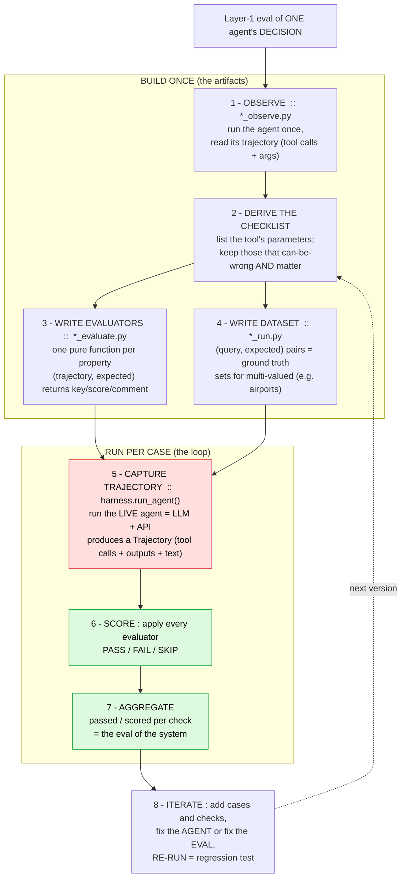
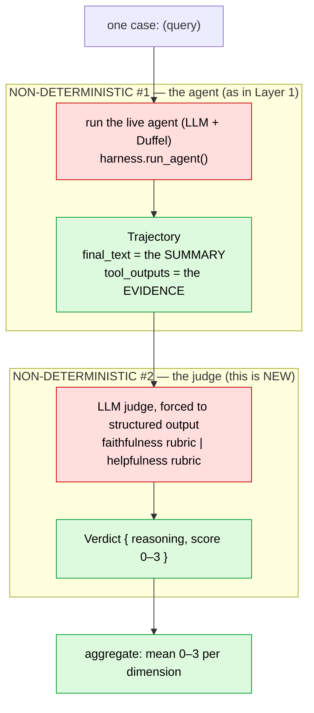
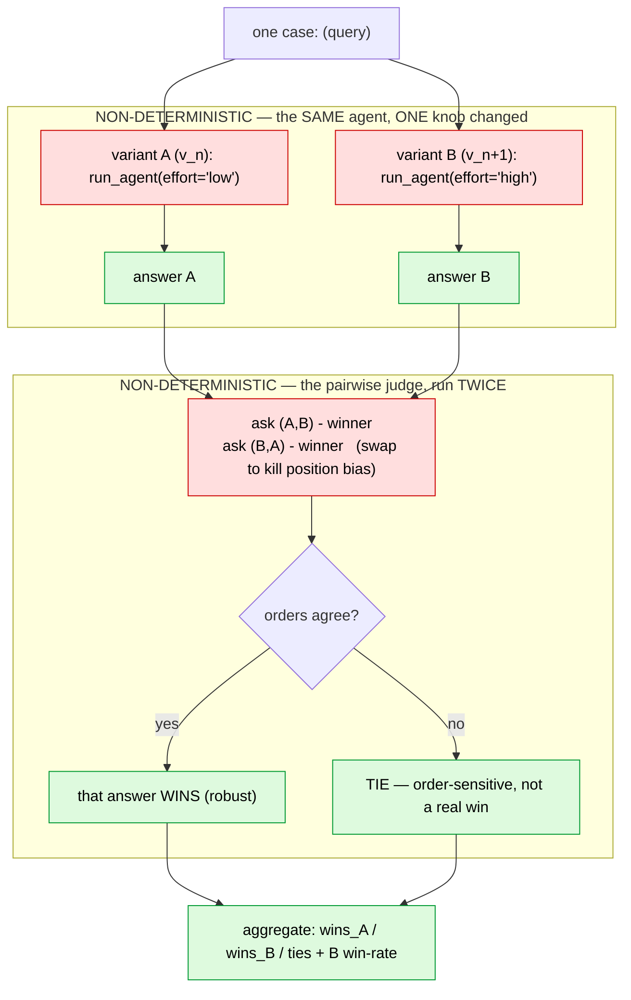
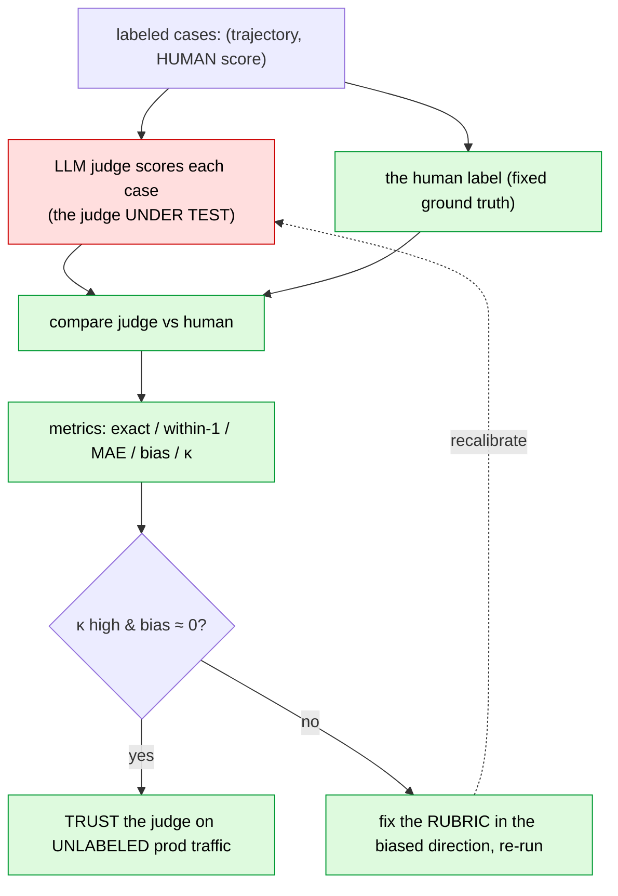

# EDD — Evaluation-Driven Development for Agents

> A step-by-step, **copy-me playbook** for evaluating LLM agents so you can ship
> them to production and keep improving them — offline and online — over time.
>
> If you're building an agent and don't know how to prove it works, start here
> and follow the steps in order. Every step maps to a real file in this folder.

_Status: Layers 1–4 complete — the full component-level rigor stack. Last
updated: 2026-07-13._

---

## Why this exists

Traditional tests assume determinism: same input → same output. **Agents break
that assumption** — the LLM makes non-deterministic decisions, calls tools, and
produces prose. You can't `assert response == "expected"`. EDD is the discipline
that replaces TDD for this world:

1. **Observe** what the agent actually does.
2. **Measure** it with layered evaluators.
3. **Improve** one thing at a time.
4. **Prove** the improvement didn't break anything else.
5. Repeat — and keep measuring in production.

The payoff: you can deploy an agent and *know* — with numbers, not vibes —
whether it's reliable, whether a change helped, and when it regresses.

---

## The mental model

### The agent-evaluation pyramid

```
                 ┌───────────────────────────────┐
  e2e / traject. │  full system → good outcome?  │   slow, few
                 ├───────────────────────────────┤
  integration    │  routing, state merge, HITL   │   medium
                 ├───────────────────────────────┤
  component ◀────│  ONE agent: right tool?        │   fast, many   ← START HERE
                 │  right args? tool succeeded?  │
                 └───────────────────────────────┘
```

A multi-agent system fails **one agent at a time**. Score only the final output
and you can't tell *which* agent broke. Build the bottom layer first: evaluate
each agent in isolation, then work up.

### The four layers of rigor

Build them **bottom-up on one agent** before scaling out.

| Layer | What it checks | Cost | Status |
|-------|----------------|------|--------|
| **1 — Code-based** | Deterministic facts: right tool, right args, tool succeeded | Free, instant | ✅ documented below |
| **2 — LLM-as-judge** | Subjective quality: faithfulness/groundedness, helpfulness (0–3) | LLM call per case | ✅ documented below |
| **3 — Pairwise** | Version A vs B — did the change actually improve things? | LLM call per pair | ✅ documented below |
| **4 — Human alignment** | Do you agree with the judge? (Cohen's κ) — validates the evaluator itself | Human labels | ✅ documented below |

---

## Core principles (read these first — they're the hard-won lessons)

1. **Observe before you evaluate.** You cannot check what you haven't looked at.
   Always run the agent and read its trajectory before writing a single check.
2. **Separate the DECISION from the RESULT.** For a tool-calling agent, the
   *decision* is which tool it called and with what arguments — deterministic and
   scoreable. The *result* is the live API/tool output — non-deterministic. **Score
   the decision, not the result.** Live data must never make your score flap.
3. **Nondeterministic input → deterministic judge.** Put all the randomness in
   one place (the live agent run) and keep the evaluators pure code. A given
   trajectory always gets the same score.
4. **Your checklist is the tool's parameter surface.** Every argument the agent
   fills from the query is a decision that can be wrong → a candidate check. Keep
   the ones that *can be wrong* **and** *matter*. Add task-success criteria and
   observed failures on top.
5. **A green check ≠ a correct evaluator.** A passing eval can still be a *wrong*
   eval (too strict). Validate your evaluators, not just your agent. Concretely:
   accept **all valid answers** (e.g. any of a city's airports), and **SKIP** what
   the query never asked for.
6. **All-green usually means the dataset is too easy.** Add adversarial cases
   until something fails — that's where the real signal is.
7. **A fixed bug becomes a regression test.** When you find a failure, lock it in
   with a test so it can never silently return.
8. **Keep the fast loop hermetic.** The local scoring loop should depend on
   nothing external (tracing off). Turn tracing on only to debug a failure or to
   run a tracked experiment.

---

## Layer 1 — deterministic checks on the agent's DECISION

### The big picture

Red = the one non-deterministic step (live agent: LLM + API). Green = the
deterministic scoring. That boundary is the whole design.



### The 8 steps (worked example: the Flights agent)

**1 · Observe** — [`flights/l1_observe.py`](flights/l1_observe.py)
Run the agent once on a real query; print its trajectory (every tool call + args,
each tool result, the final answer). Build the mental picture first.

**2 · Derive the checklist** — read the tool signature.
`search_flights(origin, destination, departure_date, return_date, adults,
children, infants, travel_class, non_stop)`. Each parameter is a decision the
agent makes. Keep those that can-be-wrong **and** matter:

| Tool param(s) | Check |
|---|---|
| origin, destination | `correct_airports` |
| departure_date, return_date | `correct_dates` |
| adults, children, infants | `correct_passengers` |
| travel_class | `correct_cabin` |
| (was the tool called at all?) | `called_search_flights` |
| non_stop | *skip — rarely specified* |

**3 · Write evaluators** — [`flights/l1_evaluate.py`](flights/l1_evaluate.py)
Each is a **pure function** with a uniform shape:

```python
def correct_airports(trajectory: list[dict], expected: dict) -> dict:
    args = _search_flights_args(trajectory)
    ok = args.get("origin") in _acceptable(expected["origin"]) \
        and args.get("destination") in _acceptable(expected["destination"])
    return {"key": "correct_airports", "score": int(ok), "comment": "..."}
```

- `score`: `1` pass, `0` fail, `None` = **not applicable** (skip — the query
  didn't specify this).
- Accept **sets** of valid answers (`_acceptable`) so a valid alternative doesn't
  false-fail. Comments explain *why* a check failed.

**4 · Write the dataset** — [`flights/l1_dataset.py`](flights/l1_dataset.py)
`(query, expected)` pairs. `expected` is the ground truth per case; use sets for
multi-valued fields; omit fields the query didn't mention.

```python
DATASET = [
    {
        "query": "Flights from New York to Tokyo on 2026-09-10, 1 adult, economy.",
        "expected": {
            "origin": {"JFK", "EWR", "LGA", "NYC"},   # any airport OR the metro code
            "destination": {"NRT", "HND", "TYO"},     # NRT/HND + Tokyo metro TYO
            "departure_date": "2026-09-10",
            "adults": 1,
            "cabin": "ECONOMY",
        },
    },
    # ...
]
```

**5 · Capture the trajectory** — `run_agent()` (in [`harness.py`](harness.py))
runs the **live** agent (`create_agent(...).ainvoke(...)`) and walks
`result["messages"]` into a `Trajectory` — `tool_calls` in the `[{"name",
"args"}]` shape the evaluators expect, plus tool outputs and final text. *This*
is the only step that calls the LLM + API.

**6 · Score** — apply every evaluator to each trajectory. `None` → SKIP (excluded
from the denominator); otherwise PASS/FAIL.

**7 · Aggregate** — `passed / scored` per evaluator. That table **is** your eval
of the system.

**8 · Iterate** — add adversarial cases, add checks, decide "agent bug vs eval
bug," fix one thing, and **re-run**. A re-run after a change is a regression test.

### How to run

```bash
# fast local loop — just the score (hermetic, no tracing)
.venv/bin/python edd/flights/l1_run.py

# the evaluators as pure functions on a fixture (no LLM, instant)
.venv/bin/python edd/flights/l1_evaluate.py

# observe a single run, traced to LangSmith
.venv/bin/python edd/flights/l1_observe.py
```

---

## Layer 2 — LLM-as-judge on the agent's SUMMARY

### The big picture

Layer 1 graded the agent's **decision** (which tool, which args) with pure code —
deterministic, free, instant. But after `search_flights` returns, the agent writes
**prose**: it summarizes the options for the traveler. You can't grade prose with
`==`. Layer 2 grades that summary with an **LLM judge**.

We're moving up the ReAct loop: Layer 1 checked *Reason → Act* (the call it made);
Layer 2 checks *Observe → Answer* (what it did with the results).

The honest new cost: in Layer 1 exactly **one** step was non-deterministic (the
live agent) and the judge was pure code. In Layer 2 **both** ends are
non-deterministic — the agent *and* the judge. That's the price of grading prose,
and the reason Layer 4 exists (you must calibrate the judge before you trust it).



### Two judges, one dimension each

| Judge | Grades the answer against… | Catches |
|---|---|---|
| `faithfulness` | the tool's **own output** (the evidence) | hallucination — an invented airline, a made-up price, a route not in the results |
| `helpfulness` | the traveler's **request** | irrelevance, burying the answer, a missing asked-for detail, verbosity |

**Never blend them into one "quality" score.** The fixture demo proves why: a
fluent, confident, totally fabricated answer ("non-stop United to Tokyo for $690")
scored **helpfulness 2/3** — it *reads* helpful — and only **faithfulness 0/3**
caught that it was a lie. A single number would have hidden the fabrication.

### Rubric design (the heart of Layer 2)

An LLM-as-judge is only as good as its rubric. Ours follow three rules:

- **Single-dimension** — each judge scores one thing (above); never a vague blend.
- **Anchored** — spell out what 0/1/2/3 concretely mean, so a score is
  reproducible instead of a mood (0 = fabricated/contradicts the evidence;
  3 = fully grounded).
- **Isolation-aware** — the agent was run **alone** on one query, with no user
  profile, budget, or upstream agents. The helpfulness rubric explicitly forbids
  penalizing the agent for context it was never handed. (This is the *isolation
  gap*: Layer 1 hit it too — same single-agent run — but for prose it's easy to
  unfairly dock an answer for "missing" info that actually lives in another agent.)

### The insight that makes judges scale: faithfulness needs **no** hand-written ground truth

Layer 1 needed an `expected` dict per case — you wrote the right answer by hand.
**Faithfulness needs none.** The tool's own output *is* the reference; the judge
checks the answer against the evidence the agent itself retrieved. That's why
LLM-as-judge scales to inputs you never labelled — and why it's the backbone of
scoring live **production** traffic, which arrives unlabelled.

### Which model judges, and how it returns a number

- **A stronger model than the one under test.** The Flights agent runs on the
  `fast` tier (gpt-5.4-mini); we judge with the `reasoning` tier (gpt-5.4). A
  grader at least as capable as the gradee — and a *different* model — reduces
  self-preference bias.
- **Forced structured output** turns an opinion into a measurement:
  `Verdict {reasoning, score}` via
  `with_structured_output(Verdict, method="function_calling")` — the
  codebase-standard path for these reasoning models (see `supervisor_agent.py`,
  `renderer.py`). `reasoning` is declared **before** `score` so the model must
  justify itself first and commit to a number second: cheap chain-of-thought that
  yields a value you can **average** and a reason you can **audit**.

### What it caught (real signal from a 5-case run)

```
faithfulness   2.00/3   (n=5)
helpfulness    2.80/3   (n=5)
```

Both dimensions surfaced issues Layer 1 is structurally blind to:

- **faithfulness** — the agent repeatedly states passenger/price framing that
  isn't in the tool output: "per person", "Total for 2 adults", "for 1 adult".
  Layer 1 confirmed the *args* were right (2 adults *was* the correct input);
  Layer 2 caught that the *prose* asserts per-person math the evidence never
  returned.
- **helpfulness** — for "New York → Tokyo" the agent silently narrowed to **JFK
  only**, never signalling it dropped EWR/LGA.

And notice the loop returns: is "for 1 adult" a real **agent** bug or a too-strict
**judge**? (The agent *knows* it searched 1 adult — that came from the query.)
That's the same *"agent bug vs eval bug"* adjudication from Layer 1, now aimed at
the **judge** itself — which is exactly what Layer 4 (calibration against human
labels) is for. A judge you haven't checked is just another unverified component.

### Closing the loop (the flywheel in one sitting)

We acted on both findings and re-ran — and the re-run *is* the regression test:

1. **Agent fix.** The flights prompt used to mandate "Price per person" and
   "Total cost estimate for group" — it literally *ordered* the fabrication.
   Rewriting it to "report each price exactly as the tool returns it; don't
   invent per-person or total math" killed the invented totals.
2. **The re-run then exposed an EVAL bug.** Faithfulness stayed at 2.00 because
   the judge now uniformly docked "for 1 adult" / "for 2 adults" — but that came
   from the *request*, not a hallucination. Verdict: **too-strict judge**, not an
   agent bug. We calibrated the faithfulness rubric to accept restated request
   parameters as grounding (only *flight* facts must come from the tool).

```
faithfulness   2.00 → 3.00 / 3
helpfulness    2.80 → 2.80 / 3   (the JFK-narrowing case remains — real, honest signal)
```

The point isn't the numbers — it's the discipline: improve **one** thing, re-run,
and let the score tell you whether you fixed the agent, fixed the eval, or
uncovered the next real issue.

### How to run

```bash
# teach the rubric on a fixed trajectory (no agent run — just the judge scoring)
.venv/bin/python edd/flights/l2_judge.py

# the full loop: live agent over the dataset → judge → aggregate mean 0–3
.venv/bin/python edd/flights/l2_judge_run.py
```

### Files (Layer 2 mirrors the Layer 1 pair)

| File | Role | Parallels |
|---|---|---|
| `flights/l2_judge.py` | the judges: `Verdict` schema + two rubrics + `build_judge()`, plus a fixture demo | `flights/l1_evaluate.py` |
| `flights/l2_judge_run.py` | live capture → judge → aggregate mean 0–3 | `flights/l1_run.py` |
| `flights/l2_judge_cases.py` | the judge's OWN dataset — labeled trajectories (borderline fixtures) | `flights/l1_dataset.py` |
| `flights/l3_judge_ab.py` | A/B on the **judge** (effort vs human labels) — the sibling of Layer 3's pairwise, aimed at the grader instead of the agent | — |

---

## Layer 3 — pairwise preference: did the change help?

### The big picture

Layers 1–2 grade an answer in ISOLATION: Layer 1 gives the decision a pass/fail,
Layer 2 gives the prose an absolute 0–3. But the question that actually drives
development is COMPARATIVE — *"I changed the prompt / bumped the model / raised
reasoning effort; is the new version BETTER?"* Two absolute scores can't answer
that once they saturate: a v(n) at helpfulness 3/3 and a v(n+1) also at 3/3 look
tied, yet one may read distinctly better. Layer 3 asks the judge the easier,
sharper question directly: **A or B?**

Relative judgments are more reliable than absolute ones — the judge doesn't have
to calibrate an internal 0–3 scale, only spot the difference between two concrete
answers. That's why pairwise is the backbone of real prompt/model iteration (and
of "LLM arena" leaderboards).



### Vary exactly ONE thing

A/B testing has one law: the two arms differ in a SINGLE factor, or you can't
attribute the difference. The runner holds the agent, tools, query, and model
fixed and changes only the reasoning **effort** (`low` → `high`) — the same knob
`l3_judge_ab.py` turned on the *judge*, now turned on the *agent*. Swap the
`VARIANT_A` / `VARIANT_B` kwargs to A/B a different axis (a model tier, a
rewritten prompt); the machinery doesn't change.

### Position bias — why one judge call is a coin flip

LLM judges systematically favor whichever answer sits in a particular slot (often
the first). Ask once and a "win" might just mean "shown first." So every pair is
judged **twice with the slots swapped**, and a winner is declared only when both
orders agree:

| shown (A,B) → | swapped (B,A) → | verdict |
|---|---|---|
| A | A | **A wins** (robust) |
| B | B | **B wins** (robust) |
| tie | tie | **genuine tie** |
| A | B *(any disagreement)* | **tie** — order-sensitive, not a real win |

This isn't paranoia — it's the single most important guard in the layer, and on
our own data it fired hard (below).

### Why helpfulness is pairwise but faithfulness stays pointwise

Pairwise needs a **shared reference** both answers are graded against. Helpfulness
has one — the *request* is identical for both variants — so "which better serves
the request" is well-posed. **Faithfulness does not:** each variant is a separate
live run, so each answer has its OWN tool output to be grounded in, and grading
A's claims against B's evidence is nonsense. So faithfulness stays a **pointwise**
Layer-2 check (answer vs its own evidence); Layer 3 compares a shared-reference
dimension — helpfulness here.

### What it caught (real signal from the 5-case run)

`effort low` (A) vs `effort high` (B), same Flights agent, same queries:

```
A (effort low) wins: 0   B (effort high) wins: 1   ties: 4   (n=5)
B win-rate (ties = ½): 60%
order-sensitive verdicts (folded into ties): 4/5
```

Two lessons, both honest:

- **More effort barely moved the needle.** Four of five cases tied — on easy,
  unambiguous queries, extra thinking doesn't change an already-good answer. A
  change that doesn't help is a *finding*, not a failure (the same result
  `l3_judge_ab.py` got A/B-ing the judge on easy inputs). Pairwise earns its keep
  the moment a change is real — a prompt rewrite, a model swap.
- **The judge is highly order-sensitive here — and the swap caught it.** 4 of 5
  verdicts *flipped* when the slots were swapped: shown one way the judge picked
  A, shown the other way it picked B. Without the swap we'd have reported those as
  real wins; with it, they're correctly folded into ties. That flip-count is the
  headline signal — a judge that contradicts itself this often on near-tie
  answers is one you **cannot trust yet** for fine distinctions. Quantifying that
  trust is exactly Layer 4.

Read the win-rate and flip-count as a *hint* at n=5, not proof — two
non-deterministic agent runs feed one non-deterministic judge. Turning the hint
into a trustworthy verdict is the next layer.

### How to run

```bash
# teach the pairwise judge on fixed answers (no agent run — just the comparison)
.venv/bin/python edd/flights/l3_pairwise.py

# the full loop: run variant A and B live over the dataset → pairwise → win-rate
.venv/bin/python edd/flights/l3_pairwise_run.py
```

### Files (Layer 3 mirrors the Layer 2 pair)

| File | Role | Parallels |
|---|---|---|
| `flights/l3_pairwise.py` | the pairwise judge: `Preference` schema + rubric + `build_pairwise_judge()` + `judge_pairwise()` (position-bias swap) + a fixture demo | `flights/l2_judge.py` |
| `flights/l3_pairwise_run.py` | run two agent variants live → pairwise judge → aggregate wins/ties + B win-rate | `flights/l2_judge_run.py` |
| `flights/l3_judge_ab.py` | the *sibling* — A/B on the **judge** (effort vs human labels), aimed at the grader, not the agent | — |

---

## Layer 4 — calibrate the judge against human labels

### The big picture

Layers 2–3 built an LLM judge and then *trusted* its numbers. Layer 4 asks the
question that makes that trust legitimate: **does the judge agree with a human?**
A judge you've never checked is just another unverified component — it might be
systematically lenient, systematically harsh, or no better than a coin flip. This
is the mirror image of Layer 2: there the trajectory was the input and the judge
was what you built; here the **judge is under test** and the human-labeled
trajectories (`flights/l2_judge_cases.py`) are the fixed ground truth. You are
evaluating the evaluator.



### The metrics (judge score vs human label, 0–3 faithfulness)

| metric | what it tells you | watch for |
|---|---|---|
| **exact-match %** | how often the judge nailed the score exactly | harsh: 2-vs-3 counts like 0-vs-3 |
| **within-1 %** | how often it's within ±1 | the practical "close enough" on an ordinal scale |
| **MAE** | mean \|judge − human\| — average distance | |
| **bias** | mean (judge − human) — the *direction* | **+ve = lenient, −ve = harsh** → which way to fix the rubric |
| **Cohen's κ** | agreement **corrected for chance** (quadratic-weighted) | 1 perfect, 0 chance, <0 worse than chance |

**Why κ and not just accuracy?** Raw agreement lies when the labels are lopsided:
on a set of mostly-3s, a judge that blindly says "3" scores ~90% and looks great.
κ subtracts the agreement you'd get by luck, so it exposes that fraud. We use the
**quadratic-weighted** variant because the scores are *ordinal* — a 0-vs-3 miss
should hurt far more than a 2-vs-3 one.

### What it caught (real run, 8 labeled cases)

```
exact match     88%      within ±1  100%      MAE  0.12
bias           -0.12  (slightly harsh)
Cohen's κ       0.94  (quadratic-weighted → almost perfect)
VERDICT: trust the judge.
```

The single disagreement was `borderline-layover-city` (human **2**, judge **1**):
the judge docked an invented layover city harder than the human did. That's not a
judge bug — it's the *borderline-is-debatable* case the label set was built to
contain, and exactly why real calibration needs several labelers (their mutual
agreement is the ceiling the judge can reach). κ = 0.94 says the L2/L3 verdicts
you've been acting on rest on a judge that genuinely tracks human judgement.

### The loop — fix the judge, never the labels

A weak calibration is a signal to rewrite the **rubric** and re-run — the same
"improve one thing, re-run" discipline as every layer, now aimed at the judge. The
**bias sign tells you the direction**: lenient → tighten the anchors; harsh →
loosen/clarify them. You never edit the human labels to match the judge — that's
grading the exam with the student's answer key, the same cardinal sin as copying
the agent's output into `expected`.

### The payoff, and the recipe for every other subagent

Once κ is high, you can point the judge at **unlabeled production traffic** and
believe the scores — the whole reason the eval stack exists (score live traffic,
harvest failures back into the datasets). To calibrate any other agent's judge,
repeat:

1. Collect 20–50 trajectories for that agent; **hand-label each** (ideally several
   people — measure their agreement first; it's your ceiling).
2. Point `l4_calibrate.py`'s judge + case set at that agent.
3. Read **κ + bias**. High κ, ~0 bias → trust it. Otherwise fix the rubric in the
   biased direction and re-run.

### How to run

```bash
.venv/bin/python edd/flights/l4_calibrate.py
```

### Files

| File | Role | Parallels |
|---|---|---|
| `flights/l4_calibrate.py` | score labeled cases with the judge → exact/within-1/MAE/bias/κ + a trust verdict | `flights/l1_run.py` |
| `flights/l2_judge_cases.py` | the human-labeled trajectories = Layer 4's ground truth | `flights/l1_dataset.py` |

---

## Ground truth — building & maintaining the dataset

Your dataset is `(query, expected)` pairs, where `expected` is the **ground
truth**: your definition of a correct decision. Getting this right is the whole
difference between a real eval and a rubber stamp.

### Where ground truth comes from
**From the task and the real world — never from the agent.** You write `expected`
from what a *correct* answer looks like, using domain knowledge, ideally before
you run the agent. The agent's output is what you *test against* the ground
truth — it is not the source of it.

> **Cardinal rule:** never blindly copy the agent's output into `expected`. That
> makes "correct" mean "whatever the agent did" — the eval always passes and can
> never catch a bug. You'd be grading the exam with the student's answer key.

### How many datasets? One per level of the pyramid
Not one giant "golden dataset." You keep **one dataset per *thing under test***,
because a dataset is defined by the *shape* of its inputs and ground truth — and
those differ by level:

| Level | How many | Input | Ground truth |
|---|---|---|---|
| **Component** (per agent) | **one per agent** (Flights, Hotels, Budget…) | that agent's query | that agent's decision (args) |
| **Integration** (supervisor) | one (or a few) | a full user request | correct routing / merge |
| **End-to-end** (system) | one (or a few) | a full trip request | final handbook quality |

Each of these *is* a "golden dataset" — for its level. Within one dataset,
sub-organize scenarios with **splits** (regression, edge-cases, "multi-city"),
**not** new files. Production never merges them: a Flights failure feeds the
Flights dataset, a routing failure feeds the integration dataset — merging would
destroy your ability to localize failures (the whole point of the pyramid).

### Accept every *valid* answer, not just the first one you thought of
Real-world entities have multiple correct representations. Encode that as a
**set**, so a valid alternative doesn't false-fail:

> **Rule for cities/airports:** ground truth for a city = **any of its airports
> OR its metro code.** New York → `{JFK, EWR, LGA, NYC}`; Tokyo → `{NRT, HND, TYO}`.

And **SKIP** (score `None`) anything the query didn't specify — you can't grade a
choice the user never asked the agent to make.

### How the dataset grows (the loop)
When a run produces something not in `expected`, that's a **trigger to
adjudicate**, never an instruction to auto-add. Ask one question — *"is this
actually correct?"*:

| The agent produced… | Verdict | Action | It was a… |
|---|---|---|---|
| a valid variant you missed (e.g. metro code `NYC`) | correct | **expand** `expected` | eval bug (too strict) |
| something genuinely wrong (e.g. `LAX` for New York) | incorrect | **leave** `expected`; keep the FAIL | agent bug (fix the agent) |

So the dataset expands by **your judgment of validity**, using the agent's
surprises as prompts to check — never by mirroring its output. Re-running matters
precisely because a non-deterministic agent reveals new valid variants over time.

### Growing it from production (the flywheel)
Once live, harvest **real user queries** from production traffic to add cases —
that keeps the dataset representative as usage drifts. But each new case still
needs a **human-judged label** (`expected`). You import the *inputs* from
production; you never let the agent's *outputs* define "correct."

### Where datasets live (code → LangSmith)
The home evolves: **inline list → a dedicated `<agent>/dataset.py` file → a
LangSmith-hosted dataset** your code references by name. Hosting it in LangSmith
(`client.create_dataset` + `create_examples`, or **Add to Dataset** from a trace)
unlocks **versions** (pin experiments for reproducible regression tests),
**splits**, **example metadata** (tag source: curated / synthetic / production),
and **automatic capture** of failing production traces via run rules — reviewed by
humans in an **annotation queue** before they become ground truth.

---

## Observability with LangSmith

Tracing is auto-captured by LangChain — no agent code changes. Three env vars:

| Variable | Job |
|---|---|
| `LANGSMITH_TRACING` | on/off switch (`"true"` / `"false"`) |
| `LANGSMITH_API_KEY` | which account/org (auth) — keep in `.env` |
| `LANGSMITH_PROJECT` | which project/bucket. **Unset → traces go to `default`.** |

Gotchas we hit (so you don't):
- **Set `LANGSMITH_PROJECT`** or your traces silently land in `default`.
- **Call `wait_for_all_tracers()`** before a short script exits, or it drops its
  spans (uploads happen on a background thread).
- **Corporate TLS interception** (e.g. a proxy with an internal root CA) makes the
  LangSmith upload fail cert verification. Fix it the *secure* way — trust the OS
  store: `pip install truststore` then `truststore.inject_into_ssl()`. Never
  disable verification.
- **Observe → trace on. Measure fast → trace off. Debug/track history → trace on.**

---

## Offline vs online (the production loop)

Layer 1 gives you both halves of a production eval story:

- **Offline** — run the dataset in CI as a **regression gate**. A prompt/model
  change that drops a score fails the build. This is your safety net for shipping.
- **Online** — once deployed, score real production traces continuously (the same
  evaluators, run against live traffic). Failing production cases become **new
  golden dataset rows** — the *data flywheel* that keeps the eval honest as real
  usage drifts.

This is exactly the skill production AI roles ask for: not "did it work once,"
but "can you prove it keeps working and improving."

---

## File map

The folder is organised **one package per agent**, so an agent's whole evaluation
suite (all layers) lives together. Shared machinery stays at the top.

```
edd/
  harness.py            # SHARED — run_agent() → Trajectory (used by every layer)
  <agent>/              # one package per agent (worked example: flights/)
    l1_dataset.py       # L1 — golden dataset: (query, expected) pairs
    l1_observe.py       # L1 — run once, print the raw trajectory
    l1_evaluate.py      # L1 — pure evaluators + a fixture demo
    l1_run.py           # L1 — live capture → score → aggregate
    l2_judge.py         # L2 — LLM judges (Verdict + rubrics + build_judge) + demo
    l2_judge_run.py     # L2 — live capture → judge → aggregate (mean 0–3)
    l2_judge_cases.py   # L2/L4 — the judge's OWN dataset: labeled trajectories
    l3_judge_ab.py      # L3 — A/B on the JUDGE (effort vs human labels) over judge_cases
    l3_pairwise.py      # L3 — pairwise judge (Preference + position-bias swap) + demo
    l3_pairwise_run.py  # L3 — A/B two agent variants live -> pairwise -> win-rate
    l4_calibrate.py     # L4 — score labeled cases with the judge -> agreement metrics
```

The `l{N}_` prefix marks the evaluation layer, so `ls` sorts each agent's folder
by layer (L1 → L2 → L3 → L4). **Adding a new agent** = copy `flights/`, swap the
agent class + tool checklist, keep the filenames. Every file imports the shared
`harness.py`; nothing in one agent's package depends on another's — so agents can
be built and tested in any order, one layer at a time.

---

## Layer 1 recap & the per-agent template

### The path we walked (Flights)
1. **Observe** — ran the agent once, read its trajectory (the ReAct loop).
2. **First evaluator** — turned one observed fact into a pure pass/fail check.
3. **Dataset** — went from one input to several `(query, expected)` cases; looped + aggregated.
4. **Layer-1 checks** — derived the full checklist from the tool's parameters (airports, dates, cabin, passengers); `SKIP` for unspecified fields.
5. **Adversarial + strictness** — hit "green ≠ correct eval"; made ground truth accept every valid answer (airports **or** metro code).
6. **Refactor** — extracted the shared `harness.py` once the capture logic repeated.
7. **Split the dataset** — moved it into its own `*_dataset.py` (one dataset per agent).

### Template — the `<agent>/` package (`harness.py` is shared)

| File | What to write |
|---|---|
| `<agent>/l1_observe.py` | `run_agent(<Agent>, query)` → print the `Trajectory`. Read what it does. |
| `<agent>/l1_evaluate.py` | One pure evaluator per **tool parameter** that can-be-wrong & matters → `EVALUATORS = [...]`. |
| `<agent>/l1_dataset.py` | `DATASET = [{"query": ..., "expected": {...}}]`. Sets for multi-valued; omit a field → SKIP. |
| `<agent>/l1_run.py` | Import the three above; loop: `run_agent → tool_calls → evaluators → aggregate`. |

### The repeatable loop (checklist)
- [ ] **Observe** one run.
- [ ] **Checklist = the tool's parameter surface** (keep *can-be-wrong × matters*).
- [ ] **One evaluator per property** (uniform `(trajectory, expected) → {key, score, comment}`).
- [ ] **Small dataset** — accept all valid answers, `SKIP` unspecified.
- [ ] **Run → score → aggregate.**
- [ ] **Adversarial cases** until something fails → *agent bug vs eval bug*.
- [ ] **Lock fixed bugs** as regression tests; **wire CI** (offline) + **online** on prod traces.

---

## Roadmap — Layers 2–4 (fill in as we build)

### Layer 2 — LLM-as-judge  _(done — see the [Layer 2](#layer-2--llm-as-judge-on-the-agents-summary) section above)_
Grades the agent's **summary**: `faithfulness` (answer vs the tool's own output)
and `helpfulness` (answer vs the request), 0–3 against anchored rubrics. Judged by
a stronger model (`reasoning` tier) with forced structured output. Files:
`flights/l2_judge.py` (judges + fixture demo) and `flights/l2_judge_run.py` (live loop).

### Layer 3 — Pairwise comparison  _(done — see the [Layer 3](#layer-3--pairwise-preference-did-the-change-help) section above)_
Compare v(n) vs v(n+1) on the same inputs; a judge picks the better response along
one dimension (helpfulness), judged in BOTH orders to cancel position bias.
Answers "did my change actually help?" without absolute ground truth. Files:
`flights/l3_pairwise.py` (pairwise judge + demo) and `flights/l3_pairwise_run.py`
(live A/B loop).

### Layer 4 — Human alignment / calibration  _(done — see the [Layer 4](#layer-4--calibrate-the-judge-against-human-labels) section above)_
Validate the judge itself: score human-labeled trajectories with the judge and
measure agreement (exact-match %, within-1 %, MAE, bias, quadratic-weighted
Cohen's κ). High κ + ~0 bias → trust the judge on unlabeled production traffic;
otherwise fix the rubric in the biased direction and re-run. Files:
`flights/l4_calibrate.py` (metrics) over `flights/l2_judge_cases.py` (the labels).

### Beyond components  _(planned)_
Integration evals (supervisor routing, parallel state merge, HITL gates) → then
end-to-end / trajectory evals of the full system.
